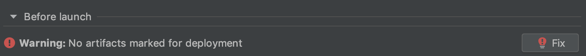
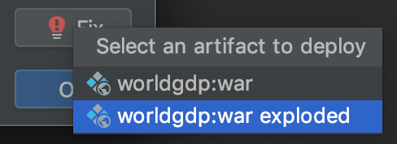
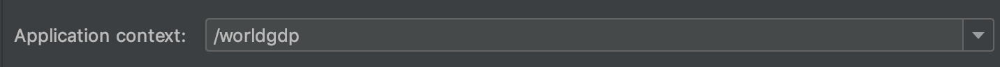

# Contents
* [Creating an empty application](#Creating-an-empty-application)
* [Defining the data access layer](#Defining-the-data-access-layer)
* [Defining the API controllers](#Defining-the-API-controllers)
* [Deploying to Tomcat](#Deploying-to-Tomcat)
* [Defining the view controller](#Defining-the-view-controller)
* [Defining the view templates](#Defining-the-view-templates)
* [Logging configuration](#Logging-configuration)

## Creating an empty application
```bash
mvn archetype:generate -DgroupId=com.github.hsseo0501.worldgdp \
-DartifactId=worldgdp -Dversion=0.0.1-SNAPSHOT -DarchetypeArtifactId=maven-archetype-webapp
```

## Defining the model classes
Country, City, CountryLanguage 그리고 CountryGDP 모델 추가
모델들에 대해 lombok의 ```@Data```, ```@Getter``` 그리고 ```@Setter``` 애노테이션 추가
* ```@Getter``` 및 ```@Settter``` 애노테이션을 추가함으로써 명시적으로 모델의 프로퍼티에 대한 getter 그리고 setter 메소드를 구현할 필요가 없다.
* ```@Data``` 애노테이션은 @ToString, @EqualsAndHashCode, @Getter / @Setter 그리고 @RequiredArgsConstructor 애노테이션을 포함한다.
> 예제에는 왜 @Data 애노테이션도 추가하고 @Getter / @Setter도 추가한건지? 
* 모델을 선언할 때 lombok을 활용하면 반복적으로 작성해야하는 모델과 관련된 코드들을 애노테이션으로 대체할 수 있다.

### Using Hibernate Validator to add validations
Country, City 그리고 CountryLanguage 모델에 대해 ```@NotNull``` 및 ```@Size``` 애노테이션 추가
* ```@NotNull``` 애노테이션은 모델의 프로퍼티 값이 Null이 될 수 없음을 체크한다.
* ```@Size``` 애노테이션은 모델의 프로퍼티 값이 애노테이션으로 정의한 제한된 범위의 값을 갖는지 체크한다.
> 이전 장에서 추가된 @Getter / @Setter 애노테이션은 제거
* 프로퍼티에 대한 유효성 검사를 위해서 hibernate validator를 활용할 수 있다.

### Reference
* lombok - [@Data](https://projectlombok.org/features/Data)
* hibernate-validator - [validating constraints](https://docs.jboss.org/hibernate/validator/6.0/reference/en-US/html_single/#_validating_constraints)


## Defining the data access layer
### Database 구성
#### 실행
```bash
# execute docker directory
docker-compose up -d
```

#### 접속
```bash
docker ps
docker exec -it ${MYSQL_CONTAINER_NAME} bash
mysql -uroot -ppwd
```
#### 데이터베이스 및 유저 생성 그리고 권한 할당
```sql
CREATE DATABASE worldgdp;
CREATE USER 'worldgdp_service'@'%' IDENTIFIED BY 'worldgdp_password';
ALTER USER worldgdp_service@'%' IDENTIFIED WITH mysql_native_password BY 'worldgdp_password';
GRANT ALL PRIVILEGES ON worldgdp.* TO 'worldgdp_service'@'%';
FLUSH PRIVILEGES;
```

### Logging 설정
Spring JDBC Template에 대한 Unit test 코드 작성 후 해당 코드에 대한 단위 테스트 실행하면 아래와 같은 메시지 발생
```bash
SLF4J: Failed to load class "org.slf4j.impl.StaticLoggerBinder".
SLF4J: Defaulting to no-operation (NOP) logger implementation
SLF4J: See http://www.slf4j.org/codes.html#StaticLoggerBinder for further details.
```

#### SLF4J 이용해서 Spring Framework에서 로깅하기
spring-context의 commons-logging 의존성 제외
```xml
<dependency>
  <groupId>org.springframework</groupId>
  <artifactId>spring-context</artifactId>
  <version>${spring.version}</version>
  <exclusions>
    <exclusion>
      <groupId>commons-logging</groupId>
      <artifactId>commons-logging</artifactId>
    </exclusion>
  </exclusions>
</dependency>
```

SLF4J 의존성 추가
```xml
<!-- slf4j -->
<dependency>
  <groupId>org.slf4j</groupId>
  <artifactId>slf4j-api</artifactId>
  <version>${slf4j.version}</version>
</dependency>

<dependency>
  <groupId>ch.qos.logback</groupId>
  <artifactId>logback-classic</artifactId>
  <version>${logback.version}</version>
</dependency>

<dependency>
  <groupId>org.slf4j</groupId>
  <artifactId>jcl-over-slf4j</artifactId>
  <version>${slf4j.version}</version>
</dependency>
```

```main.resource``` 디렉토리 하위에 ```logback.xml``` 파일 추가하고 아래와 같이 내용 추가
* 간단하게 설명하면, logger name(com.github.hsseo0501.worldgdp)에 해당하는 패키지의 클래스에 대한 로그를 레벨(debug)에 맞게 출력하라는 의미
```xml
<?xml version="1.0" encoding="UTF-8"?>
<configuration>
  <appender name="STDOUT" class="ch.qos.logback.core.ConsoleAppender">
    <layout class="ch.qos.logback.classic.PatternLayout">
      <Pattern>
        %d{yyyy-MM-dd HH:mm:ss} [%thread] %-5level %logger{36} - %msg%n
      </Pattern>
    </layout>
  </appender>

  <logger name="com.github.hsseo0501.worldgdp" level="debug" additivity="false">
    <appender-ref ref="STDOUT" />
  </logger>

  <root level="debug">
    <appender-ref ref="STDOUT" />
  </root>
</configuration>
```

> 금방 끝나는건데 maven 의존성 추가해도 자동으로 re-import 안되고 있어서 시간 소요...

### Reference
* [SLF4J 이용하여 로그 남기는 방법 (with Logback)](https://enai.tistory.com/36)

## Defining the API controllers

### Servlet 의존성 및 Tomcat 실행 환경 구성
Application 실행 전에 WorldBankApiClientTest의 단위 테스트 실행하니 아래와 같은 메시지를 확인했다. 
```text
Error:(6, 8) java: cannot access javax.servlet.ServletException
  class file for javax.servlet.ServletException not found
```

servlet 의존성을 추가한다.
```xml
<!-- servlet -->
<dependency>
  <groupId>javax.servlet</groupId>
  <artifactId>javax.servlet-api</artifactId>
  <version>3.1.0</version>
  <scope>provided</scope>
</dependency>
```

IDE는 IntelliJ를 사용하고 있는데, 프로젝트 실행과 관련해서 Tomcat에 배포하여 실행할 수 있도록 설정한다.
```Run -> Edit Configurations...```를 따라서 창을 열면 ```Run/Debug Configurations```라는 창이 뜬다.


```Tomcat Server -> Local``` 순서로 Tomcat 설정을 생성한다.  

```Application``` 항목의 ```Configure``` 을 통해 실행시 사용할 tomcat의 경로를 지정한다. 



```text
Warning: No artifacts marked for deployment
```

말 그대로 배포용으로 선택된 artifact가 없다는 메시지인데, Fix 버튼을 클릭하여 ```war exploded```를 선택한다.



위 과정을 수행하면 WorldBankApiClientTest 단위테스트도 수행되고, IDE 내에서 tomcat 실행시 ```Hello World!```를 출력하는 페이지를 확인할 수 있다. 


### Reference
* [intellij 에 servlet 프로젝트 생성하기](https://hellomyblog.tistory.com/31)


## Deploying to Tomcat
index page를 확인하면 URL이 ```http://localhost:18080/worldgdp_war_exploded/``` 인 것을 확인할 수 있다. 
```Run -> Edit Configurations... ```에서 Tomcat의 Deployment 설정을 보면 ```Application context```을 수정한다.



### Reference
* [[IntelliJ] Export War in IntelliJ and Deploy to Tomcat](https://gmlwjd9405.github.io/2018/12/24/intellij-tomcat-war-deploy.html)

## Defining the view controller

### Reference


## Defining the view templates

### Reference


## Logging configuration

### Reference