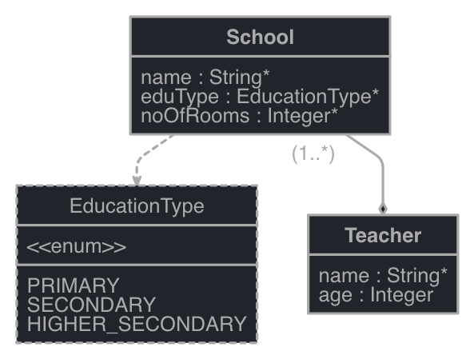

# Contents
* [Technical requirements](#Technical-requirements)
* [Introducing JHipster](#Introducing-JHipster)
* [Installing JHipster](#Installing-JHipster)
* [Creating an application](#Creating-an-application)
* [Entity creation](#Entity-creation)
* [Showing the national gross domestic product](#Showing-the-national-gross-domestic-product)
* [Other JHipster features](#Other-JHipster-features)

## Technical requirements
## Introducing JHipster
JHipster는 간략하게 설명하면 ```코드 생성 도구```라고 할 수 있다. 웹 애플리케이션 개발 플랫폼으로 다양한 개발, 빌드, 테스트 그리고 배포 프레임워크 또는 플랫폼 도구를 지원한다.
백엔드는 Spring Framework, 프론트엔드는 Angular, React 그리고 Vue.js (서드파티) 나아가 데브옵스까지 개발자가 소프트웨어 개발을 위해 구성해야 하는 부분을 간소화할 수 있게 한다. 

지원하는 기술들 (```표시```는 내가 주로 사용했던 것들)
* Build tool: ```Maven```, Gradle
* Development platform: ```Spring Framework```
* Security framework: Spring Security
* Templating: Thymeleaf
* Microservices: Netflix OSS
* RDBMS: ```H2```, MySQL, Oracle, ```PostgreSQL```, MS SQL, MariaDB
* Data streaming: ```Kafka```
* DB tracker: Liquibase
* NoSQL: MongoDB, Cassandra, Couchbase, Hazelcast
* Cache implementation: Infinispan, Ehcache
* Search engine: ELK(Elasticsearch, Logstash, and Kibana) stack
* Monitoring: Prometheus
* ORM: Hibernate
* Testing framework: Cucumber, Browsersync, Jest, Protractor test
* Load testing: Gatling
* UI: Bootstrap, HTML5, CSS3, SaaS, Redux
* JavaScript framework: Angular, Typescript, React, Webpack
* Deployment: ```Docker```, ```Kubernetes```, Boxfuse, Rancher
* CLoud support: Heroku, Cloud Foundry, AWS, OpenShift
* CI/CD: ```Jenkins```, Travis CI, GitLab CI, CircleCI 

JHipster를 사용하면 프론트엔드 ~ 백엔드 그리고 배포까지 반복되는 작업들을 손쉽게 구성할 수 있다. 예를 들어서 프론트엔드와 백엔드 사이에 데이터베이스 저장을 위한 데이터가 있으면 데이터에
대해 필수적으로 작성해야 하는 코드들을 프론트엔드 ~ 백엔드 사이에 JHipster를 이용해 구성한 프레임워크에 대한 boilerplate 코드로 자동 생성해준다. 그리고 개발자는 데이터에 대한 비지니스
로직만 추가함으로써 생산성을 높일 수 있다. 기본적으로 생성된 코드는 ```best practice```를 따르고 있다고 한다. 나아가서 완성한 코드에 대해서 배포에 대해서도 다양한 플랫폼을 지원하도록 
하고 있어 개발에 있어서 필요한 대부분 작업을 JHipster를 통해 아낄 수 있다.
> 물론 JHipster가 생성해주는 코드에 대해 알아야 한다는 ```learning curve```는 존재하지만, 유려한 디자인까지는 아니더라도 프론트엔드까지 개발하는 능력을 갖추고 싶다는 욕심을 기반으로
>스터디를 하는 입장에서 ```best practice```를 따르고 있고 다양한 기술들을 포함하고 있는 부분에서 ```learning curve```를 감안해도 흥미롭게 학습할 수 있는 도구라고 생각한다.


## Installing JHipster
JHipster는 ```Node.js```의 npm을 이용해 설치할 수 있다. ```Node.js``` 설치 후에 아래 명령어를 수행한다.
> JHispter 설치할 당시 버전은 v6.10.1이었는데 현재는 v6.10.3까지 릴리즈 된 것 같다. 

```shell script
npm install -g generator-jhipster
``` 

JHipster는 [Yeoman](http://yeoman.io/)이라는 툴을 사용한다. 

## Creating an application
JHipster를 설치한 후에 프로젝트를 수행할 디렉토리에서 아래 명령어를 수행한다.

```shell script
jhipster --skip-git # jhipster 명령만 수행하면 코드 생성 이후 자동으로 git commit을 수행한다. 
```

명령어를 수행하면 크게 아래와 같은 내용을 묻는다.
* ? Which *type* of application would you like to create? (Use arrow keys)  
  ❯ Monolithic application (recommended for simple projects)  
    Microservice application  
    Microservice gateway  
    JHipster UAA server  
> 어떤 애플리케이션을 개발할래? [JHipster UAA(User Accounting and Authorizing) server](https://www.jhipster.tech/using-uaa/)
* ? [Beta] Do you want to make it reactive with Spring WebFlux? (Yes or No)
> Spring WebFlux를 사용해서 reactive를 적용할래?
* ? What is the base name of your application? 
> 애플리케이션 이름은?
* ? What is your default Java package name?
> 애플리케이션의 패키지 이름은? 
* ? Do you want to use the JHipster Registry to configure, monitor and scale your application? (Yes or No)
> JHipster Registry를 사용할래? [JHipster Registry](https://www.jhipster.tech/jhipster-registry/)
* ? Which *type* of authentication would you like to use? (Use arrow keys)  
  ❯ JWT authentication (stateless, with a token)  
    HTTP Session Authentication (stateful, default Spring Security mechanism)  
    OAuth 2.0 / OIDC Authentication (stateful, works with Keycloak and Okta)  
> 인증을 위해서 어떤 기술을 사용할래?
* ? Which *type* of database would you like to use? (Use arrow keys)  
  ❯ SQL (H2, MySQL, MariaDB, PostgreSQL, Oracle, MSSQL)  
    MongoDB  
    Cassandra  
    Couchbase  
    [BETA] Neo4j  
    No database  
> 어떤 저장소를 사용할래?
* ? Which *production* database would you like to use? (Use arrow keys)  
  ❯ MySQL  
    MariaDB  
    PostgreSQL  
    Oracle  
    Microsoft SQL Server  
> 어떤 데이터베이스를 사용할래? (상기란에서 SQL을 선택하는 경우)
* ? Which *development* database would you like to use? (Use arrow keys)  
  ❯ H2 with disk-based persistence  
    H2 with in-memory persistence  
    MySQL  
> 개발 환경에서 어떤 데이터베이스를 사용할래?
* Do you want to use the Spring cache abstraction? (Use arrow keys)  
  ❯ Yes, with the Ehcache implementation (local cache, for a single node)   
    Yes, with the Caffeine implementation (local cache, for a single node)  
    Yes, with the Hazelcast implementation (distributed cache, for multiple nodes, supports rate-limiting for gateway applications)  
    [BETA] Yes, with the Infinispan implementation (hybrid cache, for multiple nodes)  
    Yes, with Memcached (distributed cache) - Warning, when using an SQL database, this will disable the Hibernate 2nd level cache!  
    Yes, with the Redis implementation  
    No - Warning, when using an SQL database, this will disable the Hibernate 2nd level cache!  
> Spring의 [cache abstraction](https://docs.spring.io/spring-framework/docs/3.1.x/spring-framework-reference/html/cache.html)을 사용할래?
* ? Do you want to use Hibernate 2nd level cache? (Yes or No)
> Hibernate의 2레벨 캐시를 사용할래?
* Would you like to use Maven or Gradle for building the backend? (Use arrow keys)  
  ❯ Maven  
    Gradle  
> 백엔드 빌드를 위해 Maven이랑 Gradle 중에 어떤거 사용할래? 
* Which other technologies would you like to use? (Press `<space>` to select, `<a>` to toggle all, `<i>` to invert selection)  
  ❯◯ Search engine using Elasticsearch  
   ◯ WebSockets using Spring Websocket  
   ◯ Asynchronous messages using Apache Kafka  
   ◯ API first development using OpenAPI-generator  
> 그외 어떤 기술이 더 필요하니?
* Which *Framework* would you like to use for the client? (Use arrow keys)  
  ❯ Angular  
    React  
    No client  
> 프론트엔드 프레임워크로 뭐 사용할래?
* Would you like to use a Bootswatch theme (https://bootswatch.com/)? (Use arrow keys)  
  ❯ Default JHipster  
    Cerulean  
    Cosmo  
    Cyborg  
    Darkly  
    Flatly  
    Journal  
> [Bootswatch](https://bootswatch.com/) 테마는 뭐 사용할래?
* Would you like to enable internationalization support? (Yes or No)
> 다국어 지원 할래?
* Please choose the native language of the application (Use arrow keys)  
  ❯ English  
    Estonian  
    Farsi  
    Finnish  
    French  
    Galician  
    German  
> 애플리케이션의 주 언어는 뭐로 할래?
*  Please choose additional languages to install (Press `<space>` to select, `<a>` to toggle all, `<i>` to invert selection)  
  ❯◯ Albanian  
   ◯ Arabic (Libya)  
   ◯ Armenian  
   ...  
> 다른 언어는 어떤거 선택할래?
* Besides JUnit and Jest, which testing frameworks would you like to use? (Press `<space>` to select, `<a>` to toggle all, `<i>` to invert selection)  
  ❯◯ Gatling  
   ◯ Cucumber  
   ◯ Protractor  
> JUnit이랑 Jest 외에 어떤 테스트 프레임워크 사용할래? 
* ? Would you like to install other generators from the JHipster Marketplace? (Yes or No)
> [JHipster Marketplace](https://www.jhipster.tech/modules/marketplace/#/list)에서 다른 생성기사용할래? 

프로젝트 생성에 대한 전체 과정은 아래와 같다.

```shell script
$ jhipster --skip-git
INFO! Using JHipster version installed globally
INFO! Executing jhipster:app


        ██╗ ██╗   ██╗ ████████╗ ███████╗   ██████╗ ████████╗ ████████╗ ███████╗
        ██║ ██║   ██║ ╚══██╔══╝ ██╔═══██╗ ██╔════╝ ╚══██╔══╝ ██╔═════╝ ██╔═══██╗
        ██║ ████████║    ██║    ███████╔╝ ╚█████╗     ██║    ██████╗   ███████╔╝
  ██╗   ██║ ██╔═══██║    ██║    ██╔════╝   ╚═══██╗    ██║    ██╔═══╝   ██╔══██║
  ╚██████╔╝ ██║   ██║ ████████╗ ██║       ██████╔╝    ██║    ████████╗ ██║  ╚██╗
   ╚═════╝  ╚═╝   ╚═╝ ╚═══════╝ ╚═╝       ╚═════╝     ╚═╝    ╚═══════╝ ╚═╝   ╚═╝

                            https://www.jhipster.tech

Welcome to JHipster v6.10.1
Application files will be generated in folder: /Users/abc/workspace/spring5projects/chapter05-worldgdp-jhipster
 _______________________________________________________________________________________________________________

  Documentation for creating an application is at https://www.jhipster.tech/creating-an-app/
  If you find JHipster useful, consider sponsoring the project at https://opencollective.com/generator-jhipster
 _______________________________________________________________________________________________________________

WARNING! Your Node version is not LTS (Long Term Support), use it at your own risk! JHipster does not support non-LTS releases, so if you encounter a bug, please use a LTS version first.
 ______________________________________________________________________________

  JHipster update available: 6.10.3 (current: 6.10.1)

  Run npm install -g generator-jhipster to update.

 ______________________________________________________________________________

? Which *type* of application would you like to create? Monolithic application (recommended for simple projects)
? [Beta] Do you want to make it reactive with Spring WebFlux? No
? What is the base name of your application? worldgdp
? What is your default Java package name? com.github.lucaseo90.worldgdp
? Do you want to use the JHipster Registry to configure, monitor and scale your application? No
? Which *type* of authentication would you like to use? HTTP Session Authentication (stateful, default Spring Security mechanism)
? Which *type* of database would you like to use? SQL (H2, MySQL, MariaDB, PostgreSQL, Oracle, MSSQL)
? Which *production* database would you like to use? MySQL
? Which *development* database would you like to use? H2 with disk-based persistence
? Do you want to use the Spring cache abstraction? Yes, with the Ehcache implementation (local cache, for a single node)
? Do you want to use Hibernate 2nd level cache? Yes
? Would you like to use Maven or Gradle for building the backend? Maven
? Which other technologies would you like to use?
? Which *Framework* would you like to use for the client? Angular
? Would you like to use a Bootswatch theme (https://bootswatch.com/)? Darkly
? Choose a Bootswatch variant navbar theme (https://bootswatch.com/)? Dark
? Would you like to enable internationalization support? Yes
? Please choose the native language of the application English
? Please choose additional languages to install Korean
? Besides JUnit and Jest, which testing frameworks would you like to use?
? Would you like to install other generators from the JHipster Marketplace? No

Installing languages: en, ko

KeyStore 'src/main/resources/config/tls/keystore.p12' generated successfully.

    force ../../../.yo-rc-global.json
   create .prettierrc
   create .prettierignore
   create src/main/jib/entrypoint.sh
   create checkstyle.xml
   create mvnw
   create mvnw.cmd
   create .mvn/wrapper/maven-wrapper.jar
   create .mvn/wrapper/maven-wrapper.properties
   create .mvn/wrapper/MavenWrapperDownloader.java
   create pom.xml
   create src/main/resources/banner.txt
   create src/main/resources/.h2.server.properties
   create src/main/resources/templates/error.html
   create src/main/resources/logback-spring.xml
   create src/main/resources/i18n/messages.properties
   create src/main/resources/config/liquibase/changelog/00000000000000_initial_schema.xml
   create src/main/resources/config/liquibase/master.xml
   create src/main/java/com/github/lucaseo90/worldgdp/security/SpringSecurityAuditorAware.java
   create src/main/java/com/github/lucaseo90/worldgdp/security/SecurityUtils.java
   create src/main/java/com/github/lucaseo90/worldgdp/security/AuthoritiesConstants.java
   create src/main/java/com/github/lucaseo90/worldgdp/security/package-info.java
   create src/test/java/com/github/lucaseo90/worldgdp/security/SecurityUtilsUnitTest.java
   create src/main/java/com/github/lucaseo90/worldgdp/config/SecurityConfiguration.java
   create src/main/java/com/github/lucaseo90/worldgdp/security/PersistentTokenRememberMeServices.java
   create src/main/java/com/github/lucaseo90/worldgdp/domain/PersistentToken.java
   create src/main/java/com/github/lucaseo90/worldgdp/repository/PersistentTokenRepository.java
   create src/main/java/com/github/lucaseo90/worldgdp/security/DomainUserDetailsService.java
   create src/main/java/com/github/lucaseo90/worldgdp/security/UserNotActivatedException.java
   create src/main/java/com/github/lucaseo90/worldgdp/WorldgdpApp.java
   create src/main/java/com/github/lucaseo90/worldgdp/ApplicationWebXml.java
   create src/test/java/com/github/lucaseo90/worldgdp/ArchTest.java
   create src/main/java/com/github/lucaseo90/worldgdp/aop/logging/LoggingAspect.java
   create src/main/java/com/github/lucaseo90/worldgdp/config/package-info.java
   create src/main/java/com/github/lucaseo90/worldgdp/config/AsyncConfiguration.java
   create src/main/java/com/github/lucaseo90/worldgdp/config/DateTimeFormatConfiguration.java
   create src/main/java/com/github/lucaseo90/worldgdp/config/LoggingConfiguration.java
   create src/main/java/com/github/lucaseo90/worldgdp/config/ApplicationProperties.java
   create src/main/java/com/github/lucaseo90/worldgdp/config/JacksonConfiguration.java
   create src/main/java/com/github/lucaseo90/worldgdp/config/LocaleConfiguration.java
   create src/main/java/com/github/lucaseo90/worldgdp/config/LoggingAspectConfiguration.java
   create src/main/java/com/github/lucaseo90/worldgdp/config/WebConfigurer.java
   create src/main/java/com/github/lucaseo90/worldgdp/config/StaticResourcesWebConfiguration.java
   create src/main/java/com/github/lucaseo90/worldgdp/config/Constants.java
   create src/main/java/com/github/lucaseo90/worldgdp/config/CacheConfiguration.java
   create src/main/java/com/github/lucaseo90/worldgdp/config/CloudDatabaseConfiguration.java
   create src/main/java/com/github/lucaseo90/worldgdp/config/DatabaseConfiguration.java
   create src/main/java/com/github/lucaseo90/worldgdp/config/audit/package-info.java
   create src/main/java/com/github/lucaseo90/worldgdp/config/audit/AuditEventConverter.java
   create src/main/java/com/github/lucaseo90/worldgdp/config/LiquibaseConfiguration.java
   create src/main/java/com/github/lucaseo90/worldgdp/domain/package-info.java
   create src/main/java/com/github/lucaseo90/worldgdp/domain/AbstractAuditingEntity.java
   create src/main/java/com/github/lucaseo90/worldgdp/domain/PersistentAuditEvent.java
   create src/main/java/com/github/lucaseo90/worldgdp/repository/package-info.java
   create src/main/java/com/github/lucaseo90/worldgdp/service/EmailAlreadyUsedException.java
   create src/main/java/com/github/lucaseo90/worldgdp/service/InvalidPasswordException.java
   create src/main/java/com/github/lucaseo90/worldgdp/service/UsernameAlreadyUsedException.java
   create src/main/java/com/github/lucaseo90/worldgdp/service/package-info.java
   create src/main/java/com/github/lucaseo90/worldgdp/web/rest/errors/package-info.java
   create src/main/java/com/github/lucaseo90/worldgdp/web/rest/errors/BadRequestAlertException.java
   create src/main/java/com/github/lucaseo90/worldgdp/web/rest/errors/ErrorConstants.java
   create src/main/java/com/github/lucaseo90/worldgdp/web/rest/errors/ExceptionTranslator.java
   create src/main/java/com/github/lucaseo90/worldgdp/web/rest/errors/FieldErrorVM.java
   create src/main/java/com/github/lucaseo90/worldgdp/web/rest/errors/EmailAlreadyUsedException.java
   create src/main/java/com/github/lucaseo90/worldgdp/web/rest/errors/InvalidPasswordException.java
   create src/main/java/com/github/lucaseo90/worldgdp/web/rest/errors/LoginAlreadyUsedException.java
   create src/main/java/com/github/lucaseo90/worldgdp/web/rest/vm/package-info.java
   create src/main/java/com/github/lucaseo90/worldgdp/web/rest/package-info.java
   create src/main/java/com/github/lucaseo90/worldgdp/web/rest/ClientForwardController.java
   create src/test/java/com/github/lucaseo90/worldgdp/web/rest/TestUtil.java
   create src/test/java/com/github/lucaseo90/worldgdp/web/rest/errors/ExceptionTranslatorIT.java
   create src/test/java/com/github/lucaseo90/worldgdp/web/rest/errors/ExceptionTranslatorTestController.java
   create src/test/java/com/github/lucaseo90/worldgdp/web/rest/ClientForwardControllerTest.java
   create src/test/java/com/github/lucaseo90/worldgdp/config/timezone/HibernateTimeZoneIT.java
   create src/test/java/com/github/lucaseo90/worldgdp/repository/timezone/DateTimeWrapper.java
   create src/test/java/com/github/lucaseo90/worldgdp/repository/timezone/DateTimeWrapperRepository.java
   create src/test/resources/logback.xml
   create src/test/java/com/github/lucaseo90/worldgdp/config/WebConfigurerTest.java
   create src/test/java/com/github/lucaseo90/worldgdp/config/WebConfigurerTestController.java
   create src/test/java/com/github/lucaseo90/worldgdp/config/StaticResourcesWebConfigurerTest.java
   create src/test/java/com/github/lucaseo90/worldgdp/security/DomainUserDetailsServiceIT.java
   create src/main/resources/config/liquibase/data/user.csv
   create src/main/resources/config/liquibase/data/authority.csv
   create src/main/resources/config/liquibase/data/user_authority.csv
   create src/main/resources/templates/mail/activationEmail.html
   create src/main/resources/templates/mail/creationEmail.html
   create src/main/resources/templates/mail/passwordResetEmail.html
   create src/main/java/com/github/lucaseo90/worldgdp/domain/Authority.java
   create src/main/java/com/github/lucaseo90/worldgdp/repository/AuthorityRepository.java
   create src/main/java/com/github/lucaseo90/worldgdp/repository/PersistenceAuditEventRepository.java
   create src/main/java/com/github/lucaseo90/worldgdp/service/AuditEventService.java
   create src/main/java/com/github/lucaseo90/worldgdp/web/rest/AuditResource.java
   create src/main/java/com/github/lucaseo90/worldgdp/repository/CustomAuditEventRepository.java
   create src/main/java/com/github/lucaseo90/worldgdp/domain/User.java
   create src/main/java/com/github/lucaseo90/worldgdp/repository/UserRepository.java
   create package.json
   create src/main/java/com/github/lucaseo90/worldgdp/service/UserService.java
   create src/main/java/com/github/lucaseo90/worldgdp/service/MailService.java
   create src/main/java/com/github/lucaseo90/worldgdp/service/dto/package-info.java
   create src/main/java/com/github/lucaseo90/worldgdp/service/dto/UserDTO.java
   create src/main/java/com/github/lucaseo90/worldgdp/service/dto/PasswordChangeDTO.java
   create src/main/java/com/github/lucaseo90/worldgdp/web/rest/vm/ManagedUserVM.java
   create src/main/java/com/github/lucaseo90/worldgdp/web/rest/AccountResource.java
   create src/main/java/com/github/lucaseo90/worldgdp/web/rest/UserResource.java
   create src/main/java/com/github/lucaseo90/worldgdp/web/rest/vm/KeyAndPasswordVM.java
   create src/main/java/com/github/lucaseo90/worldgdp/service/mapper/package-info.java
   create src/main/java/com/github/lucaseo90/worldgdp/service/mapper/UserMapper.java
   create src/test/java/com/github/lucaseo90/worldgdp/web/rest/AuditResourceIT.java
   create src/test/java/com/github/lucaseo90/worldgdp/service/AuditEventServiceIT.java
   create src/test/java/com/github/lucaseo90/worldgdp/repository/CustomAuditEventRepositoryIT.java
   create src/test/resources/templates/mail/testEmail.html
   create src/test/resources/i18n/messages_en.properties
   create src/test/java/com/github/lucaseo90/worldgdp/service/MailServiceIT.java
   create src/test/java/com/github/lucaseo90/worldgdp/service/UserServiceIT.java
   create src/test/java/com/github/lucaseo90/worldgdp/service/mapper/UserMapperTest.java
   create src/test/java/com/github/lucaseo90/worldgdp/web/rest/AccountResourceIT.java
   create src/test/java/com/github/lucaseo90/worldgdp/config/NoOpMailConfiguration.java
   create src/test/java/com/github/lucaseo90/worldgdp/web/rest/UserResourceIT.java
   create src/test/java/com/github/lucaseo90/worldgdp/web/rest/WithUnauthenticatedMockUser.java
   create .eslintrc.json
   create .eslintignore
   create webpack/utils.js
   create webpack/webpack.common.js
   create webpack/webpack.dev.js
   create webpack/webpack.prod.js
   create postcss.config.js
   create webpack/logo-jhipster.png
   create src/main/webapp/content/images/jhipster_family_member_0.svg
   create src/main/webapp/content/images/jhipster_family_member_1.svg
   create src/main/webapp/content/images/jhipster_family_member_2.svg
   create src/main/webapp/content/images/jhipster_family_member_3.svg
   create src/main/webapp/content/images/jhipster_family_member_0_head-192.png
   create src/main/webapp/content/images/jhipster_family_member_1_head-192.png
   create src/main/webapp/content/images/jhipster_family_member_2_head-192.png
   create src/main/webapp/content/images/jhipster_family_member_3_head-192.png
   create src/main/webapp/content/images/jhipster_family_member_0_head-256.png
   create src/main/webapp/content/images/jhipster_family_member_1_head-256.png
   create src/main/webapp/content/images/jhipster_family_member_2_head-256.png
   create src/main/webapp/content/images/jhipster_family_member_3_head-256.png
   create src/main/webapp/content/images/jhipster_family_member_0_head-384.png
   create src/main/webapp/content/images/jhipster_family_member_1_head-384.png
   create src/main/webapp/content/images/jhipster_family_member_2_head-384.png
   create src/main/webapp/content/images/jhipster_family_member_3_head-384.png
   create src/main/webapp/content/images/jhipster_family_member_0_head-512.png
   create src/main/webapp/content/images/jhipster_family_member_1_head-512.png
   create src/main/webapp/content/images/jhipster_family_member_2_head-512.png
   create src/main/webapp/content/images/jhipster_family_member_3_head-512.png
   create src/main/webapp/content/images/logo-jhipster.png
   create src/main/webapp/swagger-ui/index.html
   create src/main/webapp/swagger-ui/dist/images/throbber.gif
   create src/main/webapp/WEB-INF/web.xml
   create src/main/webapp/favicon.ico
   create src/main/webapp/robots.txt
   create src/main/webapp/404.html
   create src/main/webapp/index.html
   create src/main/webapp/manifest.webapp
    force .yo-rc.json
   create src/main/docker/app.yml
   create src/main/docker/sonar.yml
   create src/main/docker/monitoring.yml
   create src/main/docker/prometheus/prometheus.yml
   create src/main/docker/grafana/provisioning/dashboards/dashboard.yml
   create src/main/docker/grafana/provisioning/dashboards/JVM.json
   create src/main/docker/grafana/provisioning/datasources/datasource.yml
   create src/main/docker/mysql.yml
   create src/main/resources/config/application.yml
   create src/main/resources/config/application-dev.yml
   create src/main/resources/config/application-tls.yml
   create src/main/resources/config/application-prod.yml
   create src/test/resources/config/application.yml
   create src/test/resources/config/application-testcontainers.yml
   create src/main/webapp/app/home/home.component.html
   create src/main/webapp/app/layouts/main/main.component.html
   create src/main/webapp/app/layouts/navbar/navbar.component.html
   create proxy.conf.json
   create tsconfig.json
   create tsconfig.base.json
   create tsconfig.app.json
   create tslint.json
   create angular.json
   create src/main/webapp/content/scss/_bootstrap-variables.scss
   create src/main/webapp/content/scss/global.scss
   create src/main/webapp/content/scss/vendor.scss
   create src/main/webapp/content/css/loading.css
   create src/main/webapp/app/app.main.ts
   create src/main/webapp/app/app.module.ts
   create src/main/webapp/app/app-routing.module.ts
   create src/main/webapp/app/app.constants.ts
   create src/main/webapp/app/polyfills.ts
   create src/main/webapp/app/vendor.ts
   create src/main/webapp/app/layouts/footer/footer.component.html
   create src/main/webapp/app/layouts/error/error.component.html
   create src/main/webapp/app/account/activate/activate.component.html
   create src/main/webapp/app/account/password/password.component.html
   create src/main/webapp/app/blocks/config/prod.config.ts
   create src/main/webapp/app/blocks/config/uib-pagination.config.ts
   create src/main/webapp/app/blocks/interceptor/errorhandler.interceptor.ts
   create src/main/webapp/app/blocks/interceptor/notification.interceptor.ts
   create src/main/webapp/app/blocks/interceptor/auth-expired.interceptor.ts
   create src/main/webapp/app/entities/entity.module.ts
   create src/main/webapp/app/home/home.module.ts
   create src/main/webapp/app/home/home.route.ts
   create src/main/webapp/app/home/home.component.ts
   create src/main/webapp/app/layouts/profiles/page-ribbon.component.ts
   create src/main/webapp/app/layouts/profiles/profile.service.ts
   create src/main/webapp/app/layouts/profiles/profile-info.model.ts
   create src/main/webapp/app/layouts/main/main.component.ts
   create src/main/webapp/app/layouts/navbar/navbar.component.ts
   create src/main/webapp/app/layouts/navbar/navbar.route.ts
   create src/main/webapp/app/layouts/footer/footer.component.ts
   create src/main/webapp/app/account/register/register.component.html
   create src/main/webapp/app/account/password-reset/init/password-reset-init.component.html
   create src/main/webapp/app/account/password-reset/finish/password-reset-finish.component.html
   create src/main/webapp/app/account/settings/settings.component.html
   create src/main/webapp/app/account/sessions/sessions.component.html
   create src/main/webapp/app/layouts/error/error.route.ts
   create src/main/webapp/app/layouts/error/error.component.ts
   create src/main/webapp/app/layouts/navbar/active-menu.directive.ts
   create src/main/webapp/app/layouts/profiles/page-ribbon.scss
   create src/main/webapp/app/layouts/navbar/navbar.scss
   create src/main/webapp/app/home/home.scss
   create src/main/webapp/app/account/account.route.ts
   create src/main/webapp/app/account/account.module.ts
   create src/main/webapp/app/account/activate/activate.route.ts
   create src/main/webapp/app/account/activate/activate.component.ts
   create src/main/webapp/app/account/activate/activate.service.ts
   create src/main/webapp/app/account/password/password.route.ts
   create src/main/webapp/app/account/password/password-strength-bar.component.ts
   create src/main/webapp/app/account/password/password.component.ts
   create src/main/webapp/app/account/password/password.service.ts
   create src/main/webapp/app/account/register/register.route.ts
   create src/main/webapp/app/admin/configuration/configuration.component.html
   create src/main/webapp/app/admin/docs/docs.component.html
   create src/main/webapp/app/account/register/register.component.ts
   create src/main/webapp/app/admin/health/health.component.html
   create src/main/webapp/app/admin/health/health-modal.component.html
   create src/main/webapp/app/account/register/register.service.ts
   create src/main/webapp/app/account/password-reset/init/password-reset-init.route.ts
   create src/main/webapp/app/account/password-reset/init/password-reset-init.component.ts
   create src/main/webapp/app/account/password-reset/init/password-reset-init.service.ts
   create src/main/webapp/app/account/password-reset/finish/password-reset-finish.route.ts
   create src/main/webapp/app/account/password-reset/finish/password-reset-finish.component.ts
   create src/main/webapp/app/account/password-reset/finish/password-reset-finish.service.ts
   create src/main/webapp/app/account/settings/settings.route.ts
   create src/main/webapp/app/account/settings/settings.component.ts
   create src/main/webapp/app/account/sessions/sessions.route.ts
   create src/main/webapp/app/account/sessions/session.model.ts
   create src/main/webapp/app/account/sessions/sessions.component.ts
   create src/main/webapp/app/account/sessions/sessions.service.ts
   create src/main/webapp/app/account/password/password-strength-bar.scss
   create src/main/webapp/app/admin/admin-routing.module.ts
   create src/main/webapp/app/admin/logs/logs.component.html
   create src/main/webapp/app/admin/metrics/metrics.component.html
   create src/main/webapp/app/admin/audits/audits.component.html
   create src/main/webapp/app/admin/user-management/user-management.component.html
   create src/main/webapp/app/admin/configuration/configuration.route.ts
   create src/main/webapp/app/admin/configuration/configuration.module.ts
   create src/main/webapp/app/admin/configuration/configuration.component.ts
   create src/main/webapp/app/admin/configuration/configuration.service.ts
   create src/main/webapp/app/admin/docs/docs.route.ts
   create src/main/webapp/app/admin/docs/docs.module.ts
   create src/main/webapp/app/admin/docs/docs.component.ts
   create src/main/webapp/app/admin/docs/docs.scss
   create src/main/webapp/app/admin/health/health.route.ts
   create src/main/webapp/app/admin/health/health.module.ts
   create src/main/webapp/app/admin/health/health.component.ts
   create src/main/webapp/app/admin/health/health-modal.component.ts
   create src/main/webapp/app/admin/health/health.service.ts
   create src/main/webapp/app/admin/logs/logs.route.ts
   create src/main/webapp/app/admin/logs/logs.module.ts
   create src/main/webapp/app/admin/logs/log.model.ts
   create src/main/webapp/app/admin/user-management/user-management-detail.component.html
   create src/main/webapp/app/admin/user-management/user-management-update.component.html
   create src/main/webapp/app/admin/user-management/user-management-delete-dialog.component.html
   create src/main/webapp/app/admin/logs/logs.component.ts
   create src/main/webapp/app/admin/logs/logs.service.ts
   create src/main/webapp/app/admin/metrics/metrics.route.ts
   create src/main/webapp/app/admin/metrics/metrics.module.ts
   create src/main/webapp/app/admin/metrics/metrics.component.ts
   create src/main/webapp/app/admin/metrics/metrics.service.ts
   create src/main/webapp/app/admin/audits/audits.route.ts
   create src/main/webapp/app/admin/audits/audits.module.ts
   create src/main/webapp/app/admin/audits/audit-data.model.ts
   create src/main/webapp/app/admin/audits/audit.model.ts
   create src/main/webapp/app/admin/audits/audits.component.ts
   create src/main/webapp/app/admin/audits/audits.service.ts
   create src/main/webapp/app/admin/user-management/user-management.route.ts
   create src/main/webapp/app/admin/user-management/user-management.module.ts
   create src/main/webapp/app/admin/user-management/user-management.component.ts
   create src/main/webapp/app/admin/user-management/user-management-detail.component.ts
   create src/main/webapp/app/shared/login/login.component.html
   create src/test/javascript/jest.conf.js
   create src/main/webapp/app/admin/user-management/user-management-update.component.ts
   create src/main/webapp/app/admin/user-management/user-management-delete-dialog.component.ts
   create src/main/webapp/app/core/core.module.ts
   create src/main/webapp/app/core/login/login.service.ts
   create src/main/webapp/app/core/user/account.model.ts
   create src/main/webapp/app/core/icons/font-awesome-icons.ts
   create src/main/webapp/app/core/login/login.model.ts
   create src/main/webapp/app/core/login/login-modal.service.ts
   create src/main/webapp/app/core/user/user.service.ts
   create src/main/webapp/app/core/user/user.model.ts
   create src/main/webapp/app/core/language/language.constants.ts
   create src/main/webapp/app/shared/shared.module.ts
   create src/main/webapp/app/shared/shared-libs.module.ts
   create src/main/webapp/app/shared/constants/error.constants.ts
   create src/main/webapp/app/shared/constants/input.constants.ts
   create src/main/webapp/app/shared/constants/pagination.constants.ts
   create src/main/webapp/app/shared/constants/authority.constants.ts
   create src/main/webapp/app/shared/util/request-util.ts
   create src/main/webapp/app/shared/alert/alert.component.ts
   create src/main/webapp/app/shared/alert/alert-error.component.ts
   create src/main/webapp/app/shared/alert/alert-error.model.ts
   create src/main/webapp/app/shared/util/datepicker-adapter.ts
   create src/main/webapp/app/shared/login/login.component.ts
   create src/main/webapp/app/shared/language/find-language-from-key.pipe.ts
   create src/main/webapp/app/core/auth/csrf.service.ts
   create src/main/webapp/app/core/auth/state-storage.service.ts
   create src/main/webapp/app/shared/auth/has-any-authority.directive.ts
   create src/main/webapp/app/core/auth/account.service.ts
   create src/main/webapp/app/core/auth/user-route-access-service.ts
   create src/main/webapp/app/core/auth/auth-session.service.ts
   create src/test/javascript/jest.ts
   create src/test/javascript/jest-global-mocks.ts
   create src/test/javascript/spec/test.module.ts
   create src/test/javascript/spec/app/admin/configuration/configuration.component.spec.ts
   create src/test/javascript/spec/app/admin/configuration/configuration.service.spec.ts
   create src/test/javascript/spec/app/admin/health/health.component.spec.ts
   create src/test/javascript/spec/app/admin/logs/logs.component.spec.ts
   create src/test/javascript/spec/app/admin/logs/logs.service.spec.ts
   create src/test/javascript/spec/app/admin/metrics/metrics.component.spec.ts
   create src/test/javascript/spec/app/admin/metrics/metrics.service.spec.ts
   create src/test/javascript/spec/app/core/user/account.service.spec.ts
   create src/test/javascript/spec/app/home/home.component.spec.ts
   create src/test/javascript/spec/app/layouts/main/main.component.spec.ts
   create src/test/javascript/spec/app/layouts/navbar/navbar.component.spec.ts
   create src/test/javascript/spec/helpers/spyobject.ts
   create src/test/javascript/spec/helpers/mock-account.service.ts
   create src/test/javascript/spec/helpers/mock-route.service.ts
   create src/test/javascript/spec/helpers/mock-login.service.ts
   create .gitignore
   create .gitattributes
   create .editorconfig
   create src/test/javascript/spec/helpers/mock-login-modal.service.ts
   create sonar-project.properties
   create .huskyrc
   create .lintstagedrc.js
   create src/test/javascript/spec/helpers/mock-event-manager.service.ts
   create src/test/javascript/spec/helpers/mock-active-modal.service.ts
   create src/test/javascript/spec/helpers/mock-state-storage.service.ts
   create src/test/javascript/spec/helpers/mock-alert.service.ts
   create src/test/javascript/spec/app/account/activate/activate.component.spec.ts
   create src/test/javascript/spec/app/account/password/password.component.spec.ts
   create src/test/javascript/spec/app/account/password/password-strength-bar.component.spec.ts
   create src/test/javascript/spec/app/account/password-reset/init/password-reset-init.component.spec.ts
   create src/test/javascript/spec/app/account/password-reset/finish/password-reset-finish.component.spec.ts
   create src/test/javascript/spec/app/account/register/register.component.spec.ts
   create src/test/javascript/spec/app/account/settings/settings.component.spec.ts
   create src/test/javascript/spec/app/shared/login/login.component.spec.ts
   create src/test/javascript/spec/app/shared/alert/alert.component.spec.ts
   create src/test/javascript/spec/app/shared/alert/alert-error.component.spec.ts
   create src/test/javascript/spec/app/core/login/login-modal.service.spec.ts
   create src/main/resources/i18n/messages_en.properties
   create src/test/javascript/spec/app/admin/audits/audits.component.spec.ts
   create src/test/javascript/spec/app/admin/audits/audits.service.spec.ts
   create src/test/javascript/spec/app/admin/user-management/user-management.component.spec.ts
   create src/test/javascript/spec/app/admin/user-management/user-management-detail.component.spec.ts
   create src/test/javascript/spec/app/admin/user-management/user-management-update.component.spec.ts
   create src/test/javascript/spec/app/admin/user-management/user-management-delete-dialog.component.spec.ts
   create src/test/javascript/spec/app/core/user/user.service.spec.ts
   create src/test/javascript/spec/app/account/sessions/sessions.component.spec.ts
   create src/test/javascript/spec/helpers/mock-language.service.ts
   create README.md
   create src/main/webapp/i18n/en/audits.json
   create src/main/webapp/i18n/en/configuration.json
   create src/main/webapp/i18n/en/error.json
   create src/main/webapp/i18n/en/login.json
   create src/main/webapp/i18n/en/home.json
   create src/main/webapp/i18n/en/metrics.json
   create src/main/resources/i18n/messages_ko.properties
   create src/test/resources/i18n/messages_ko.properties
   create src/main/webapp/i18n/en/logs.json
   create src/main/webapp/i18n/en/password.json
   create src/main/webapp/i18n/en/register.json
   create src/main/webapp/i18n/en/sessions.json
   create src/main/webapp/i18n/en/settings.json
   create src/main/webapp/i18n/en/user-management.json
   create src/main/webapp/i18n/en/activate.json
   create src/main/webapp/i18n/en/global.json
   create src/main/webapp/i18n/en/health.json
   create src/main/webapp/i18n/en/reset.json
   create src/main/webapp/i18n/ko/audits.json
   create src/main/webapp/i18n/ko/configuration.json
   create src/main/webapp/i18n/ko/error.json
   create src/main/webapp/i18n/ko/login.json
   create src/main/webapp/i18n/ko/home.json
   create src/main/webapp/i18n/ko/metrics.json
   create src/main/webapp/i18n/ko/logs.json
   create src/main/webapp/i18n/ko/password.json
   create src/main/webapp/i18n/ko/register.json
   create src/main/webapp/i18n/ko/sessions.json
   create src/main/webapp/i18n/ko/settings.json
   create src/main/webapp/i18n/ko/user-management.json
   create src/main/webapp/i18n/ko/activate.json
   create src/main/webapp/i18n/ko/global.json
   create src/main/webapp/i18n/ko/health.json
   create src/main/webapp/i18n/ko/reset.json


I'm all done. Running npm install for you to install the required dependencies. If this fails, try running the command yourself.


npm WARN deprecated tslint@6.1.2: TSLint has been deprecated in favor of ESLint. Please see https://github.com/palantir/tslint/issues/4534 for more information.
npm WARN deprecated chokidar@2.1.8: Chokidar 2 will break on node v14+. Upgrade to chokidar 3 with 15x less dependencies.
npm WARN deprecated fsevents@1.2.13: fsevents 1 will break on node v14+ and could be using insecure binaries. Upgrade to fsevents 2.
npm WARN deprecated request@2.88.2: request has been deprecated, see https://github.com/request/request/issues/3142
npm WARN deprecated @hapi/joi@15.1.1: joi is leaving the @hapi organization and moving back to 'joi' (https://github.com/sideway/joi/issues/2411)
npm WARN deprecated rollup-plugin-babel@4.4.0: This package has been deprecated and is no longer maintained. Please use @rollup/plugin-babel.
npm WARN deprecated har-validator@5.1.5: this library is no longer supported
npm WARN deprecated @hapi/topo@3.1.6: This version has been deprecated and is no longer supported or maintained
npm WARN deprecated @hapi/address@2.1.4: This version has been deprecated and is no longer supported or maintained
npm WARN deprecated @hapi/bourne@1.3.2: This version has been deprecated and is no longer supported or maintained
npm WARN deprecated @hapi/hoek@8.5.1: This version has been deprecated and is no longer supported or maintained
npm WARN deprecated resolve-url@0.2.1: https://github.com/lydell/resolve-url#deprecated
npm WARN deprecated urix@0.1.0: Please see https://github.com/lydell/urix#deprecated
npm WARN deprecated request-promise-native@1.0.9: request-promise-native has been deprecated because it extends the now deprecated request package, see https://github.com/request/request/issues/3142
npm WARN deprecated core-js@2.6.11: core-js@<3 is no longer maintained and not recommended for usage due to the number of issues. Please, upgrade your dependencies to the actual version of core-js@3.

> fsevents@1.2.13 install /Users/abc/workspace/spring5projects/chapter05-worldgdp-jhipster/node_modules/browser-sync/node_modules/fsevents
> node install.js

  SOLINK_MODULE(target) Release/.node
  CXX(target) Release/obj.target/fse/fsevents.o
  SOLINK_MODULE(target) Release/fse.node

> fsevents@1.2.13 install /Users/abc/workspace/spring5projects/chapter05-worldgdp-jhipster/node_modules/watchpack-chokidar2/node_modules/fsevents
> node install.js

  SOLINK_MODULE(target) Release/.node
  CXX(target) Release/obj.target/fse/fsevents.o
  SOLINK_MODULE(target) Release/fse.node

> fsevents@1.2.13 install /Users/abc/workspace/spring5projects/chapter05-worldgdp-jhipster/node_modules/webpack-dev-server/node_modules/fsevents
> node install.js

  SOLINK_MODULE(target) Release/.node
  CXX(target) Release/obj.target/fse/fsevents.o
  SOLINK_MODULE(target) Release/fse.node

> husky@4.2.5 install /Users/abc/workspace/spring5projects/chapter05-worldgdp-jhipster/node_modules/husky
> node husky install

husky > Setting up git hooks
husky > Done

> @fortawesome/fontawesome-common-types@0.2.32 postinstall /Users/abc/workspace/spring5projects/chapter05-worldgdp-jhipster/node_modules/@fortawesome/fontawesome-common-types
> node attribution.js

Font Awesome Free 0.2.32 by @fontawesome - https://fontawesome.com
License - https://fontawesome.com/license/free (Icons: CC BY 4.0, Fonts: SIL OFL 1.1, Code: MIT License)


> @scarf/scarf@0.1.5 postinstall /Users/abc/workspace/spring5projects/chapter05-worldgdp-jhipster/node_modules/@scarf/scarf
> node ./report.js


    The dependency 'ngx-infinite-scroll' is tracking installation
    statistics using Scarf (https://scarf.sh), which helps open-source developers
    fund and maintain their projects. Scarf securely logs basic installation
    details when this package is installed. The Scarf npm library is open source
    and permissively licensed at https://github.com/scarf-sh/scarf-js. For more
    details about your project's dependencies, try running 'npm ls'. To opt out of
    analytics, set the environment variable 'SCARF_ANALYTICS=false'.


> ejs@2.7.4 postinstall /Users/abc/workspace/spring5projects/chapter05-worldgdp-jhipster/node_modules/@surma/rollup-plugin-off-main-thread/node_modules/ejs
> node ./postinstall.js

Thank you for installing EJS: built with the Jake JavaScript build tool (https://jakejs.com/)


> core-js@2.6.11 postinstall /Users/abc/workspace/spring5projects/chapter05-worldgdp-jhipster/node_modules/core-js
> node -e "try{require('./postinstall')}catch(e){}"

Thank you for using core-js ( https://github.com/zloirock/core-js ) for polyfilling JavaScript standard library!

The project needs your help! Please consider supporting of core-js on Open Collective or Patreon:
> https://opencollective.com/core-js
> https://www.patreon.com/zloirock

Also, the author of core-js ( https://github.com/zloirock ) is looking for a good job -)


> ejs@2.7.4 postinstall /Users/abc/workspace/spring5projects/chapter05-worldgdp-jhipster/node_modules/mem-fs-editor/node_modules/ejs
> node ./postinstall.js

Thank you for installing EJS: built with the Jake JavaScript build tool (https://jakejs.com/)


> ejs@3.1.3 postinstall /Users/abc/workspace/spring5projects/chapter05-worldgdp-jhipster/node_modules/ejs
> node --harmony ./postinstall.js

Thank you for installing EJS: built with the Jake JavaScript build tool (https://jakejs.com/)


> spawn-sync@1.0.15 postinstall /Users/abc/workspace/spring5projects/chapter05-worldgdp-jhipster/node_modules/spawn-sync
> node postinstall


> ejs@2.7.4 postinstall /Users/abc/workspace/spring5projects/chapter05-worldgdp-jhipster/node_modules/webpack-bundle-analyzer/node_modules/ejs
> node ./postinstall.js

Thank you for installing EJS: built with the Jake JavaScript build tool (https://jakejs.com/)


> @angular/cli@10.0.0 postinstall /Users/abc/workspace/spring5projects/chapter05-worldgdp-jhipster/node_modules/@angular/cli
> node ./bin/postinstall/script.js


> husky@4.2.5 postinstall /Users/abc/workspace/spring5projects/chapter05-worldgdp-jhipster/node_modules/husky
> opencollective-postinstall || exit 0

Thank you for using husky!
If you rely on this package, please consider supporting our open collective:
> https://opencollective.com/husky/donate


> ngx-infinite-scroll@9.0.0 postinstall /Users/abc/workspace/spring5projects/chapter05-worldgdp-jhipster/node_modules/ngx-infinite-scroll
> opencollective-postinstall || exit 0

Thank you for using ngx-infinite-scroll!
If you rely on this package, please consider supporting our open collective:
> https://opencollective.com/ngx-infinite-scroll/donate

npm notice created a lockfile as package-lock.json. You should commit this file.
npm WARN notsup Unsupported engine for watchpack-chokidar2@2.0.0: wanted: {"node":"<8.10.0"} (current: {"node":"14.3.0","npm":"6.14.5"})
npm WARN notsup Not compatible with your version of node/npm: watchpack-chokidar2@2.0.0
npm WARN @fortawesome/angular-fontawesome@0.6.1 requires a peer of @angular/core@^9.0.0 but none is installed. You must install peer dependencies yourself.
npm WARN @fortawesome/angular-fontawesome@0.6.1 requires a peer of tslib@^1.10.0 but none is installed. You must install peer dependencies yourself.
npm WARN @ng-bootstrap/ng-bootstrap@6.1.0 requires a peer of @angular/common@^9.0.0 but none is installed. You must install peer dependencies yourself.
npm WARN @ng-bootstrap/ng-bootstrap@6.1.0 requires a peer of @angular/core@^9.0.0 but none is installed. You must install peer dependencies yourself.
npm WARN @ng-bootstrap/ng-bootstrap@6.1.0 requires a peer of @angular/forms@^9.0.0 but none is installed. You must install peer dependencies yourself.
npm WARN @ng-bootstrap/ng-bootstrap@6.1.0 requires a peer of @angular/localize@^9.0.0 but none is installed. You must install peer dependencies yourself.
npm WARN @ng-bootstrap/ng-bootstrap@6.1.0 requires a peer of tslib@^1.10.0 but none is installed. You must install peer dependencies yourself.
npm WARN @ngx-translate/core@12.1.2 requires a peer of tslib@^1.10.0 but none is installed. You must install peer dependencies yourself.
npm WARN @ngx-translate/http-loader@5.0.0 requires a peer of tslib@^1.10.0 but none is installed. You must install peer dependencies yourself.
npm WARN bootstrap@4.5.0 requires a peer of jquery@1.9.1 - 3 but none is installed. You must install peer dependencies yourself.
npm WARN bootstrap@4.5.0 requires a peer of popper.js@^1.16.0 but none is installed. You must install peer dependencies yourself.
npm WARN ngx-cookie-service@3.0.4 requires a peer of @angular/common@^9.0.5 but none is installed. You must install peer dependencies yourself.
npm WARN ngx-cookie-service@3.0.4 requires a peer of @angular/core@^9.0.5 but none is installed. You must install peer dependencies yourself.
npm WARN ngx-cookie-service@3.0.4 requires a peer of tslib@^1.10.0 but none is installed. You must install peer dependencies yourself.
npm WARN ngx-webstorage@5.0.0 requires a peer of @angular/common@^9.0.0 but none is installed. You must install peer dependencies yourself.
npm WARN ngx-webstorage@5.0.0 requires a peer of @angular/core@^9.0.0 but none is installed. You must install peer dependencies yourself.
npm WARN ngx-webstorage@5.0.0 requires a peer of tslib@^1.10.0 but none is installed. You must install peer dependencies yourself.
npm WARN codelyzer@5.2.2 requires a peer of @angular/compiler@>=2.3.1 <10.0.0 || >9.0.0-beta <10.0.0 || >9.1.0-beta <10.0.0 || >9.2.0-beta <10.0.0 but none is installed. You must install peer dependencies yourself.
npm WARN codelyzer@5.2.2 requires a peer of @angular/core@>=2.3.1 <10.0.0 || >9.0.0-beta <10.0.0 || >9.1.0-beta <10.0.0 || >9.2.0-beta <10.0.0 but none is installed. You must install peer dependencies yourself.

added 2610 packages from 1106 contributors and audited 2613 packages in 84.537s

95 packages are looking for funding
  run `npm fund` for details

found 6 vulnerabilities (5 low, 1 high)
  run `npm audit fix` to fix them, or `npm audit` for details

If you find JHipster useful consider sponsoring the project https://www.jhipster.tech/sponsors/

Server application generated successfully.

Run your Spring Boot application:
./mvnw

Client application generated successfully.

Start your Webpack development server with:
 npm start


> worldgdp@0.0.1-SNAPSHOT cleanup /Users/abc/workspace/spring5projects/chapter05-worldgdp-jhipster
> rimraf target/classes/static/

INFO! Congratulations, JHipster execution is complete!
```

### Project structure
생성한 프로젝트는 크게 백엔드를 위한 Spring Boot 애플리케이션 코드 및 프론트엔드를 위한 Angular 애플리케이션 코드 그리고 데이터베이스를 위한 Liquibase changelog 파일을 포함한다.
그외 추가적으로 다양한 설정 파일을 포함한다. 

프로젝트 구조  

* package ( ~.)
  * ~.aop.logging: logging을 위한 Aspect-Oriented Programming (AOP) advice 설정 포함
  * ~.config: properties, cache, database, profile, Liquibase, logging, Spring Securiry, metrics, web, locale과 같은 다양한 설정 포함
  * ~.config.audit: JHipster는 auditing features를 독자적(out of box)로 제공, auditing을 위한 설정을 포함
  * ~.domain: 모든 오브젝트에 대한 모델을 포함 
  * ~.repository: 모델을 위한 Spring Data ```Java Persistence API(JPA)```를 포함
  * ~.security: 모든 security와 관련된 클래스들을 포함 ```Roles``` 및 ```UserDetail``` 서비스 등  
  * ~.service: ```service-layer```에 해당하는 클래스들을 포함
  * ~.service.dto: ```data transfer objects (DTOs) ```를 포함
  * ~.service.mapper: 모델 오브젝트들에 대한 DTOs를 위한 ```mapper``` 클래스들을 포함
  * ~.web.rest: 모든 ```Representational State Transfer (REST)``` controller 클래스들을 포함 
  * ~.web.rest.errors: REST call 호출시 예외 상황에 대한 처리를 하는 클래스들을 포함
  * ~.web.rest.vm: ```view model```들을 포함, 주로 UI의 Administration 탭에서 사용 
* resources
  * config: 다양한 설정파일들을 포함
  * i18n: 다국어 지원을 위한 파일들을 포함
  * templates: 메일 템플릿과 같은 템플릿 파일들을 포함

애플리케이션 실행을 위해서는 다음과 같은 명령어를 사용한다.

```shell script
mvnw
```

만약에 애플리케이션을 빌드해서 다른 서버에 배포하는 경우 다음과 같은 명령어를 사용한다.

```shell script
mvnw -Pprod package
gradlew -Pprod bootWar
```


## Entity creation
들어가기에 앞서 엔티티(Entity)는 데이터베이스에 존재하는 테이블에 대한 구성을 애플리케이션에서 표현하기 위한 논리적인 대상이라고 이해하면 될 것 같다. 웹 애플리케이션을 개발하면 애플리케이션 
내에서 사용하는 데이터를 데이터베이스에 저장하기 위해 추가해야 하는 `최소한의 기능`이 있는데, `CRUD`(Create, Read, Update 그리고 Delete)라 불리는 데이터 삽입(Create), 
조회(Read), 수정(Update) 그리고 삭제(Delete) 기능을 위한 로직을 추가해야 한다. 최소한이라고 하지만 간단한 데이터를 추가하는 경우에도, 이미 해당 기능이 구현된 엔티티와 같이 최소한의 
CRUD 기능을 포함하기 위한 노력은 간단하지만 않다. 아래는 Entity가 추가되는 경우 필요한 작업을 나열한다.
* 데이터베이스에 데이터 저장을 위한 테이블을 생성
* 모델 개체에 대한 엔티티를 구성하고 데이터베이스와 애플리케이션 사이의 인터페이스를 위한 `DAO`(Data Access Object) 계층를 추가
* 모델 개체에 대한 고유한 로직을 포함하는 비지니스 로직을 서비스 계층에 추가
* 모댈 개체가 애플리케이션 외부에 웹 또는 서버간 상호작용을 위해 필요한 경우 웹 컨트롤러 및 프론트 계층을 추가

위와 같은 작업은 애플리케이션에 엔티티가 추가가 필요한 경우 수반되는 `최소한의 과정`이라고 할 수 있다. 나아가 추가된 모델 개체에 대한 비지니스 로직을 추가하는 작업은 새로운 노력을 필요로
하는데, 더욱이 서비스 계층, 웹 컨트롤러 및 프론트 계층은 요구사항에 따라 변화를 수용해야 하는 유연성이 필요하다. JHipster는 위와 같은 `데이터 접근 계층(Data Access Layer)`에 대한 
코드를 자동 생성할 수 있는 기능을 제공한다. JHipster에서는 이를 `Entity Generation`이라 한다. Entity는 JHipster 애플리케이션의 구성요소에 해당하며, Entity Generation 
과정을 수행하면 아래와 같은 작업을 JHipster가 진행한다. 
* 데이터베이스 테이블을 생성하고 데이터베이스 테이블에 대한 변화를 관리
* `Spring Data JPA 레포지토리`를 기반으로 JPA 모델 클래스를 구성
* 비즈니스 규칙을 수용하기 위한 서비스 계층에 대한 기능을 옵션으로 제공
* 프론트 엔드 및 이를 통해 기본적인 CRUD 기능을 수행하기 위한 REST 컨트롤러들을 생성 
* 통합 및 성능 테스트를 포함하는 컴포넌트 및 서비스

> JHipster를 활용하여 엔티티를 관리하면, 프론트 엔드 ~ 데이터베이스 사이에 필요한 기본적인 CRUD 기능들을 구현하기 위한 시간 소모보다 비즈니스 로직에 집중할 수 있다. 

### Adding an entity with the CLI 
JHipster에서 엔티티 추가를 해보자. 엔티티 이름은 `Owner`이며 속성(Attribute)는 `name`만을 갖는다. JHipster는 엔티티를 생성하면 데이터 접근(Data Access), 서비스 
계층(Service Layer), 컨트롤러 그리고 프론트엔드에 걸쳐 엔티티와 관련된 코드가 생성된다. 아래 명령어를 JHipster로 생성한 프로젝트 경로에서 수행하자.

```shell script
jhipster entity Owner
```

```shell script
$ jhipster entity Owner
INFO! Using JHipster version installed locally in current project's node_modules
INFO! Executing jhipster:entity Owner

The entity Owner is being created.


Generating field #1

? Do you want to add a field to your entity? Yes
? What is the name of your field? createdField
? What is the type of your field? String
? Do you want to add validation rules to your field? (y/N)
(base) Lucas-MacBookPro:worldgdp abc$ jhipster entity Owner
INFO! Using JHipster version installed locally in current project's node_modules
INFO! Executing jhipster:entity Owner

The entity Owner is being created.


Generating field #1

? Do you want to add a field to your entity? Yes
? What is the name of your field? createdField
? What is the type of your field? String
? Do you want to add validation rules to your field? Yes
? Which validation rules do you want to add? Required, Unique

================= Owner =================
Fields
createdField (String) required unique


Generating field #2

? Do you want to add a field to your entity? No

================= Owner =================
Fields
createdField (String) required unique


Generating relationships to other entities

? Do you want to add a relationship to another entity? No

================= Owner =================
Fields
createdField (String) required unique


? Do you want to use separate service class for your business logic? Yes, generate a separate service interface and implementation
? Do you want to use a Data Transfer Object (DTO)? Yes, generate a DTO with MapStruct
? Do you want to add filtering? Not needed
? Is this entity read-only? No
? Do you want pagination on your entity? Yes, with pagination links

Everything is configured, generating the entity...

... 코드 생성을 하면서 이미 존재하는 파일에 덮어쓸지 등의 질문을 함

```

`git status`로 확인하면 엔티티를 생성하면서 변경이 이루어지거나 새로 추가된 파일을 확인할 수 있다.
```shell script
Changes not staged for commit: ... 
        modified:   .yo-rc.json
        modified:   README.md
        modified:   src/main/java/com/github/lucaseo90/worldgdp/config/CacheConfiguration.java
        modified:   src/main/resources/config/liquibase/master.xml
        modified:   src/main/webapp/app/entities/entity.module.ts
        modified:   src/main/webapp/app/layouts/navbar/navbar.component.html
        modified:   src/main/webapp/i18n/en/global.json
        modified:   src/main/webapp/i18n/ko/global.json

Untracked files: ...
        src/main/java/com/github/lucaseo90/worldgdp/domain/Owner.java
        src/main/java/com/github/lucaseo90/worldgdp/repository/OwnerRepository.java
        src/main/java/com/github/lucaseo90/worldgdp/service/OwnerService.java
        src/main/java/com/github/lucaseo90/worldgdp/service/dto/OwnerDTO.java
        src/main/java/com/github/lucaseo90/worldgdp/service/impl/OwnerServiceImpl.java
        src/main/java/com/github/lucaseo90/worldgdp/service/mapper/EntityMapper.java
        src/main/java/com/github/lucaseo90/worldgdp/service/mapper/OwnerMapper.java
        src/main/java/com/github/lucaseo90/worldgdp/web/rest/OwnerResource.java
        src/main/resources/config/liquibase/changelog/20201010094153_added_entity_Owner.xml
        src/main/resources/config/liquibase/fake-data/owner.csv
        src/main/webapp/app/entities/owner/owner.component.html
        src/main/webapp/app/entities/owner/owner.component.ts
        src/main/webapp/app/entities/owner/owner.module.ts
        src/main/webapp/app/entities/owner/owner.route.ts
        src/main/webapp/app/entities/owner/owner.service.ts
        src/main/webapp/app/entities/owner/owner-delete-dialog.component.html
        src/main/webapp/app/entities/owner/owner-delete-dialog.component.ts
        src/main/webapp/app/entities/owner/owner-detail.component.html
        src/main/webapp/app/entities/owner/owner-detail.component.ts
        src/main/webapp/app/entities/owner/owner-update.component.html
        src/main/webapp/app/entities/owner/owner-update.component.ts
        src/main/webapp/app/shared/model/owner.model.ts
        src/main/webapp/i18n/en/owner.json
        src/main/webapp/i18n/ko/owner.json
        src/test/java/com/github/lucaseo90/worldgdp/domain/
        src/test/java/com/github/lucaseo90/worldgdp/service/dto/
        src/test/java/com/github/lucaseo90/worldgdp/service/mapper/OwnerMapperTest.java
        src/test/javascript/spec/app/entities/owner/owner.component.spec.ts
        src/test/javascript/spec/app/entities/owner/owner.service.spec.ts
        src/test/javascript/spec/app/entities/owner/owner-delete-dialog.component.spec.ts
        src/test/javascript/spec/app/entities/owner/owner-detail.component.spec.ts
        src/test/javascript/spec/app/entities/owner/owner-update.component.spec.ts
```

`추가된 코드 및 수정된 코드에 대해 확인하고 해당 내용 정리`

이제 릴레이션(relationship)이 필요한 엔티티를 추가해보자. 

```shell script
jhipster entity Car
```

`실습하고 실습 내용 정리`

### Modeling the entity

#### Modeling with UML
앞서 CLI를 통해 JHipster로 생성한 애플리케이션에 엔티티를 추가하는 방법을 알아봤다. 앞의 방법을 통해 엔티티가 추가되었을 때, 엔티티와 관련하여 생성되는 코드는 분명 생산성에 도움이 된다. 
다만 애플리케이션이 포함하는 엔티티의 개수가 적다면 상관없겠지만, 엔티티의 개수가 많아지는 경우 매번 CLI를 통해서 엔티티를 추가하는 경우 문제가 달라진다. JHipster는 다수의 엔티티를 추가하기
위해서 Modelio, UML Desinger 또는 GenMyModel과 같은 클래스 다이어그램 도구를 통해 설계된 클래스 다이어그램을 XMI 파일로 만들어서(export) 가져올(import) 수 있는 기능을 
제공한다. 

먼저 `JHipster UML`을 설치한다.

```shell script
# For global installation
npm instlal -g jhipster-uml

# For local installation
npm instlal -g jhipster-uml --dev
```      

다음 명령을 통해 UML 파일을 가져올 수 있다.

```shell script
jhipster-uml <class-diagram.xmi>
```

추가하는 엔티티에 대해서 JHipster는 엔티티의 타입(type)별로 유효성 검증(validation)을 설정해 줄 수 있는데 다음과 같다.

타입 | 가능한 유효성 검증
--- | ---
string | required, minlength, maxlength, pattern
integer, long, BigDecimal, float, double | required, min, max
enum, Boolean, LocalDate, ZonedDateTime | required
blob, AnyBlob, ImageBlob, TextBlob | required, minbytes, maxbytes

그리고 앞서 JHipster CLI를 통해서 엔티티를 추가했을 때 DTO, pagination 그리고 service class와 같은 옵션을 확인할 수 있었는데, UML을 가져오는 경우에도 옵션을 사용할 수 있다.

```shell script
# 엔티티에 대한 DTO의 생성을 원하는 경우, DTO와 엔티티 사이의 변환은 MapStruct를 활용
jhipster-uml <class-diagram.xmi> --dto <value> 

# 엔티티에 대한 pagination 방법 [pager, pagination, infinite-scroll]
jhipster-uml <class-diagram.xmi> --paginate <value>

# 엔티티에 대한 비즈니스 로직을 서비스 레이어(service layer)를 구분하여 구현하고자 하는 경우 [serviceClass, serviceImpl]
jhipster-uml <class-diagram.xmi> --service <value> 
``` 

이 외에도 엔티티간 릴레이션을 설정하는 등의 기능도 지원하는데, JHipster에서 지원하는 엔티티 사이의 릴레이션은 아래와 같다.
* A bidirectional one-to-many relationship 
* A unidirectional many-to-one relationship 
* A many-to-many relationship
* A bidirectional one-to-one relationship
* A unidirectional one-to-one relationship

`undirectional one-to-many` 릴레이션은 JHipster에서 지원하지 않는 대신에, 필요하다면 bidrectional one-to-many 릴레이션을 추천한다.

#### Modeling with JHipster Domain Language Studio
UML을 이용해 엔티티를 생성하는 기능은 CLI를 이용해 생성하는 기능보다 생산적이며 효율적으로 보인다. 하지만 이 또한 매번 UML 생성을 위한 외부 도구를 이용해 UML을 설계해야 하는 번거로움과
의존성이 있다. 그리고 JHipster는 버전에 따라 UML을 통해 엔티티를 가져오는 기능에 제한적인 부분이 존재하여 최악의 경우 전혀 호환되지 않는 경우가 발생할 수 있다. 따라서 JHipster를 통해
엔티티를 관리하는 경우 JDL Studio를 사용하는 것이 가장 좋은 선택이다. JDL Studio는 엔티티를 생성하고, 엔티티 간의 관계를 구성하기 위한 JHipster 팀에서 지원하는 온라인 도구이며, 
호환성 또한 좋다. 

JDL은 JHipster Domain Language의 약자로, 간단하고 쉬운 구문(Syntax)로 단일 파일(때로는 여러 개의 파일이 될 수도 있다)에서 엔티티를 구성하기 위한 도메인 언어(domain 
language)다. JDL을 사용하는 방법으로는 잘 알려진 IDE의 플러그인(plugin)으로 설치하거나 온라인 페이지인 [JDL-Studio](https://start.jhipster.tech/jdl-studio/)를
이용하는 방법이 있다. 
> Eclipse, Visual Studio Code, Atom 지원, IntelliJ 지원 안 함

다음은 간단한 예제를 JDL-Studio를 이용해 살펴보자.
```text
entity School {
    name String required
    eduType EducationType required
    noOfRooms Integer required min(5) max(99)
}
   
enum EducationType {
    PRIMARY, SECONDARY, HIGHER_SECONDARY
}
   
entity Teacher {
    name String required
    age Integer min(21) max(58)
}

// defining multiple one-to-many relationships with comments
relationship OneToMany {
    School{teacher} to Teacher{school(name) required}
}
   
// Set pagination options
paginate School with infinite-scroll
paginate Teacher with pagination
   
// Use data transfer objects (DTO)
dto * with mapstruct

// In case if DTO is not required for specific (comma separated)entities.
// dto * with mapstruct except School
// Set service options to all except few

service all with serviceImpl
// In case if service layer is not required for certain  
// (comma separated) entities. Just uncomment below line
// service all with serviceImpl except School
```



키워드에 대해서 살펴보자. 
entity 키워드: 엔티티를 정의, 덧붙여 엔티티와 관련한 애트리뷰트(attribute) 및 데이터 타입을 정의, 애트리뷰트의 타입과 관련한 유효성 검증도 정의할 수 있음 
* 이러한 유효성 검증은 데이터베이스 테이블 수준(Database Table Level) 뿐만 아니라 프론트엔드에도 부과(impose)된다. 
maxlength 키워드: 애트리뷰트의 maximum 컬럼 길이
min, max 키워드: 애트리뷰트의 min ~ max 값(value)  

엔티티들 사이의 릴레이션은 다음과 같은 구문으로 정의

```text
relationship (OneToMany | ManyToOne | OneToOne | ManyToMany) {
    <OWNER entity>[{<Relationship name>[(<Display field>)]}] to <DESTINATION entity>[{<Relationship name>[(<Display field>)]}]
}
```

릴레이션은 아래와 같은 다양한 설정을 갖는다. 
* (OneToMany | ManyToOne | OneToOne | ManyToMany): 릴레이션 종류
* OWNER entity: 릴레이션의 주체 엔티티(릴레이션의 소스), 릴레이션을 소유하는 엔티티가 왼쪽에 있어야 한다. 
* DESTINATION entity: 릴레이션의 대상 엔티티(릴레이션의 타겟)
* Relationship name: 다른쪽 유형을 나타내는 필드의 이름 
* Display field: 엔터티에 대한 레코드를 추가하는 동안 JHipster는 화면에 다른 측면 엔터티 드롭 다운 메뉴를 표시하는데, 해당 속성은 드롭 다운 메뉴에 표시되는 다른 쪽 엔터티의 필드 이름을 표시, 기본적으로 다른 쪽 엔터티의 ID (기본 키)
* required: 드롭 다운 메뉴에서 다른 쪽 엔티티를 선택해야하는지 여부를 결정  

엔티티와 연관한 코드 생성을 위한 설정도 있다.
* paginate: 엔티티에 대한 pagination pattern
* dto: 엔티티에 대한 DTO 생성할지
* service: 엔티티에 대한 서비스 계층 생성할지
  * 상기 3가지 키워드의 경우 엔티티를 포함하고 제외하는데 있어 `with *` 또는 `except`와 같은 키워드를 사용   


예제의 경우 bidirectional relationship인데 undirectional relationship이 필요한 경우 아래와 같이 정의한다.
```text
relationship OneToMany {
  School to Teacher
}
```

이와 같이 JDL을 사용하는 경우 CLI와 같은 `the question-and-answer-based approach`보다 효율적이며 생산적이다.

##### Generating an entity using a model
JDL Studio에서 엔티티에 대한 정보를 담고 있는 JDL(.jh) 파일을 내보내기 하여 다운받아, JHipster 프로젝트를 생성한 경로에서, 엔티티에 대한 데이터베이스 테이블과 소스 코드를 생성하자.

```shell script
jhipster import-jdl <your_jdl_file.jh>
```

위 명령은 엔티티 정의를 내보내고, 필요한 아티팩트를 생성하기 위해 JDL 파일을 가져온다.

파일을 생성한 후 `mvnw` 명령을 이용해서 성공적으로 빌드 및 배포가 되면 School과 Teacher 엔티티들을 웹페이지의 `Entities` 메뉴에서 확인할 수 있다. 또한 데이터베이스의 변경분도 
자동으로 반영된다. 

때때로 애플리케이션에 따라 대규모의 엔티티들 포함하면서, 여러 팀에서 협업하여 개발하는 경우도 있을 것이다. 이런 경우를 위해 JHipster는 다수의 JDL 파일을 지원한다. 

`import-jdl` 명령은 변경된 엔티티에 대해서만 재생성을 수행하는데, 만약 모든 엔티티를 다시 처음부터 생성하고 싶다면 `-force` 옵션을 사용하면 된다. 이 경우 생성됐었던 코드의 수정된
내용은 모두 지워지기 때문에 주의를 필요로 한다. 특정 유효성 검사는 `mvnw` 명령을 통해 애플리케이션을 빌드하고 배포하는 시점에 포착된다.
* integer, long, BigDecimal, LocalDate, Boolean, enum, double과 같은 타입은 minlength 및 minlength 유효성을 추가할 수 없으나 추가된 경우
* 만약 서비스 계층(service layer)가 주어진 엔티티를 벗어나는 경우`?(확인 필요)`, JHipster는 경고 메시지를 보여주고 애플리케이션이 잘 동작하지 않을 수 있다.
  * > 서비스 계층이 연관된 엔티티가 아닌 다른 엔티티에 접근하여 처리하도록 하는 경우를 말하는 건지..? 
* 한줄짜리 주석을 추가하는 경우 `//` 다음에 스페이스 한 칸을 추가해야 한다. 만약 그렇지 않으면 JHipster는 에러를 보여주고 엔티티를 생성하지 못할 수 있다. 


## Showing the national gross domestic product
엔티티를 생성하는 방법을 알았으니, 이제 1장에서 개발한 나라별 GDP를 확인할 수 있는 `world GDP`(이하 `worldgdp`) 애플리케이션을 JHipster를 활용해 만들어보자. 

### Application and entity creation
JDL을 이용해 엔티티들을 정의한다. JDL을 사용함으로써 엔티티에 대한 REST 컨트롤러, 서비스 계층 및 DTO 그리고 프론트엔드 계층을 위한 컴포넌트들에 대한 코드를 생성할 수 있다. 다음은 
JDL를 이용해 worldgdp 애플리케이션에 대한 엔티티를 정의한 스크립트다. 

```text
entity Country {
    code String required maxlength(3)
    name String required maxlength(52)
    continent Continent required
    region String required maxlength(26)
    surfaceArea Float required
    population Integer required
    lifeExpectancy Float
    localName String required maxlength(45)
    governmentForm String required maxlength(45)
}

entity City {
    name String required maxlength(35)
    district String required maxlength(20)
    population Integer required
}

entity CountryLanguage {
    language String required
    isOfficial TrueFalse required
    percentage Float required
}

enum Continent {
    ASIA, EUROPE, NORTH_AMERICA, AFRICA, OCEANIA, ANTARCTICA, SOUTH_AMERICA
}

enum TrueFalse {
    T, F
}

// Set pagination options
paginate Country, City, CountryLanguage with pagination

// Use data transfer objects (DTO)
dto * with mapstruct

// Set service options. Alternatively 'Service all with sericeImpl can be used
service all with serviceImpl

relationship OneToMany {
    Country{city} to City {country(name) required}
    Country{countryLanguage} to CountryLanguage{country(name) required}
}

filter Country
```


상기 스크립트가 포함하는 내용 
* 엔티티에 대한 테이블과 포함하고 있는 컬럼들에 대한 이름 및 타입 정의
  * 예) `Country`, `City` 및 `CountryLanguage`
* 엔티티에서 사용하는 `enum` 타입 
  * 예) `Continent` 및 `TrueFalse`
* 엔티티에 대한 pagination pattern, DTO structure 및 service layer (`Service` 클래스와 인터페이스(`ServiceImpl`))에 대한 정의
* 엔티티들 사이의 릴레이션 관계 예) `Country` 엔티티는 `City` 엔티티와 `CountryLanguage` 엔티티에 대해 one-to-many 관계가 있음을 정의  
  * 릴레이션에서 `country(name)`은 `Country`의 국가 ID 대신에 국가 이름을 참조로 표시
* 엔티티에 대한 필터 정의  
  * 필터가 정의된 `Country` 엔티티는 엔티티에 대한 레코드를 읽어올 때를 위해 다양한 `filtering criteria`를 포함  

Chapter01에서 생성한 테이블에서 몇 개의 컬럼을 생략했으므로, 이러한 부분을 고려하여 삽입(insert) 스크립트에서도 변경이 필요한데, 수정된 [insert script](https://github.com/PacktPublishing/Spring-5.0-Projects/blob/master/Chapter05/gdp/download/gdp_insert_script.sql) 
를 받아서 이후 내용을 진행하기 전에 적용한다.  

### Handling enumeration data with a database in JHipster
`mvnw` 명령을 이용해 실행하는 경우 기본적으로 `-Ddev` 옵션으로 실행되어 H2 데이터베이스를 사용하기 때문에, MySQL을 사용하기 위해서는 아래와 같이 `-Pprod` 옵션을 통해 실행되도록 해야 
한다. 또한 MySQL을 세팅해야 하는데 chapter01에서 생성한 docker 기반 데이터베이스에 새로운 데이터베이스를 생성하여 활용할 것이기 때문에 환경에 설정을 맞춰서 다음 과정을 수행한다.

docker 확인하여 bash 접속

```bash
docker ps
docker exec -it ${MYSQL_CONTAINER_NAME} bash
mysql -uroot -ppwd
```

데이터베이스 및 유저 생성 그리고 권한 할당

```sql
CREATE DATABASE worldgdp_jhipster;
CREATE USER 'worldgdp_service'@'%' IDENTIFIED BY 'worldgdp_password'; # 이미 계정은 생성했기 때문에 수행하지 않아도 됌 
ALTER USER worldgdp_service@'%' IDENTIFIED WITH mysql_native_password BY 'worldgdp_password'; # 이미 계정은 생성했기 때문에 수행하지 않아도 됌
GRANT ALL PRIVILEGES ON worldgdp_jhipster.* TO 'worldgdp_service'@'%';
FLUSH PRIVILEGES;
```

데이터베이스에 상기 언급한 삽입 스크립트를 이용해 테이블에 데이터를 넣는다.

```shell script
./mvnw -Pprod
```

`Entities` 항목에서 `Country`에 대한 정보를 확인하려 하면 아래와 같이 에러가 발생한다.
```text
2020-10-14 18:57:53.317 ERROR 30719 --- [ XNIO-1 task-27] o.z.problem.spring.common.AdviceTraits   : Internal Server Error

org.springframework.dao.InvalidDataAccessApiUsageException: No enum constant com.github.lucaseo90.worldgdp.domain.enumeration.Continent.North America; nested exception is java.lang.IllegalArgumentException: No enum constant com.github.lucaseo90.worldgdp.domain.enumeration.Continent.North America...
```

에러는 열거형(enum) 타입인 Continent 데이터를 읽어올 때 발생하는데, Country 엔티티의 Continent 컬럼이 열거형으로 선언되어 있기 때문에 발생한다. 정확하게는 삽입 스크립트로 추가된 
데이터가 enum에 정의된 값과 다르기 때문이다. 예로 데이터베이스에는 `North America`로 데이터가 삽입되었는데 열거형으로는 `NORTH_AMERICA`로 정의되어 있으며 `Asia`의 경우에도 
`ASIA`로 정의되어 있기 때문에 그렇다. 나아가서 Java의 열거형 타입에는 밑줄 문자나 띄어쓰기를 포함할 수 없기 때문에, 데이터베이스의 값과 Java의 열거형 값을 매핑하기 위한 방법이 필요하다. 
해결책으로 이와 같은 문제를 해결하기 위해 `JPA Attribute Converter`를 활용하면 된다.    

`JPA Attribute Converter`를 이용해 열거형 데이터를 데이터베이스에서 가져와 매핑하도록 하면 에러는 사라진다. 다만 화면에 열거형 데이터가 그대로 출력되는 것을 확인할 수 있다. 이유는
JHipster는 애플리케이션을 생성할 때 다국어 지원을 위해서 화면에 출력되는 값을 json 파일로 따로 관리한다. 따라서 `/src/main/webapp/app/entities/country`에서 화면에 표시되는 
값은 키(worldgdpApp.country.home.title)를 통해 값을 참조하는데, 참조해야 하여 출력하는 값을 열거형에 대한 json 파일(`contient.json`)에서 수정하면 된다. 

해당 링크는 상기 과정에 대해 수정된 코드의 변경분이 포함된 커밋이며, 이를 통해 직관적으로 이해할 수 있다.
[Followed 'Handling enumeration data with a database in JHipster'](https://github.com/lucaseo90/spring5projects/commit/a14b24dd707e9fd1e5f6c8c083fbc34dbe39f4c7)

### Filter provision in service, persistence, and the REST controller layer

#### The persistence layer

#### The service layer

#### The REST controller layer

#### Adding a filter option to existing entities

## Other JHipster features

# worldgdp

This application was generated using JHipster 6.10.1, you can find documentation and help at [https://www.jhipster.tech/documentation-archive/v6.10.1](https://www.jhipster.tech/documentation-archive/v6.10.1).

## Development

Before you can build this project, you must install and configure the following dependencies on your machine:

1. [Node.js][]: We use Node to run a development web server and build the project.
   Depending on your system, you can install Node either from source or as a pre-packaged bundle.

After installing Node, you should be able to run the following command to install development tools.
You will only need to run this command when dependencies change in [package.json](package.json).

```
npm install
```

We use npm scripts and [Webpack][] as our build system.

Run the following commands in two separate terminals to create a blissful development experience where your browser
auto-refreshes when files change on your hard drive.

```

./mvnw


npm start
```

Npm is also used to manage CSS and JavaScript dependencies used in this application. You can upgrade dependencies by
specifying a newer version in [package.json](package.json). You can also run `npm update` and `npm install` to manage dependencies.
Add the `help` flag on any command to see how you can use it. For example, `npm help update`.

The `npm run` command will list all of the scripts available to run for this project.

### PWA Support

JHipster ships with PWA (Progressive Web App) support, and it's turned off by default. One of the main components of a PWA is a service worker.

The service worker initialization code is commented out by default. To enable it, uncomment the following code in `src/main/webapp/index.html`:

```html
<script>
  if ('serviceWorker' in navigator) {
    navigator.serviceWorker.register('./service-worker.js').then(function () {
      console.log('Service Worker Registered');
    });
  }
</script>
```

Note: [Workbox](https://developers.google.com/web/tools/workbox/) powers JHipster's service worker. It dynamically generates the `service-worker.js` file.

### Managing dependencies

For example, to add [Leaflet][] library as a runtime dependency of your application, you would run following command:

```
npm install --save --save-exact leaflet
```

To benefit from TypeScript type definitions from [DefinitelyTyped][] repository in development, you would run following command:

```
npm install --save-dev --save-exact @types/leaflet
```

Then you would import the JS and CSS files specified in library's installation instructions so that [Webpack][] knows about them:
Edit [src/main/webapp/app/vendor.ts](src/main/webapp/app/vendor.ts) file:

```
import 'leaflet/dist/leaflet.js';
```

Edit [src/main/webapp/content/scss/vendor.scss](src/main/webapp/content/scss/vendor.scss) file:

```
@import '~leaflet/dist/leaflet.css';
```

Note: There are still a few other things remaining to do for Leaflet that we won't detail here.

For further instructions on how to develop with JHipster, have a look at [Using JHipster in development][].

### Using Angular CLI

You can also use [Angular CLI][] to generate some custom client code.

For example, the following command:

```
ng generate component my-component
```

will generate few files:

```
create src/main/webapp/app/my-component/my-component.component.html
create src/main/webapp/app/my-component/my-component.component.ts
update src/main/webapp/app/app.module.ts
```

## Building for production

### Packaging as jar

To build the final jar and optimize the worldgdp application for production, run:

```

./mvnw -Pprod clean verify


```

This will concatenate and minify the client CSS and JavaScript files. It will also modify `index.html` so it references these new files.
To ensure everything worked, run:

```

java -jar target/*.jar


```

Then navigate to [http://localhost:8080](http://localhost:8080) in your browser.

Refer to [Using JHipster in production][] for more details.

### Packaging as war

To package your application as a war in order to deploy it to an application server, run:

```

./mvnw -Pprod,war clean verify


```

## Testing

To launch your application's tests, run:

```
./mvnw verify
```

### Client tests

Unit tests are run by [Jest][] and written with [Jasmine][]. They're located in [src/test/javascript/](src/test/javascript/) and can be run with:

```
npm test
```

For more information, refer to the [Running tests page][].

### Code quality

Sonar is used to analyse code quality. You can start a local Sonar server (accessible on http://localhost:9001) with:

```
docker-compose -f src/main/docker/sonar.yml up -d
```

You can run a Sonar analysis with using the [sonar-scanner](https://docs.sonarqube.org/display/SCAN/Analyzing+with+SonarQube+Scanner) or by using the maven plugin.

Then, run a Sonar analysis:

```
./mvnw -Pprod clean verify sonar:sonar
```

If you need to re-run the Sonar phase, please be sure to specify at least the `initialize` phase since Sonar properties are loaded from the sonar-project.properties file.

```
./mvnw initialize sonar:sonar
```

For more information, refer to the [Code quality page][].

## Using Docker to simplify development (optional)

You can use Docker to improve your JHipster development experience. A number of docker-compose configuration are available in the [src/main/docker](src/main/docker) folder to launch required third party services.

For example, to start a mysql database in a docker container, run:

```
docker-compose -f src/main/docker/mysql.yml up -d
```

To stop it and remove the container, run:

```
docker-compose -f src/main/docker/mysql.yml down
```

You can also fully dockerize your application and all the services that it depends on.
To achieve this, first build a docker image of your app by running:

```
./mvnw -Pprod verify jib:dockerBuild
```

Then run:

```
docker-compose -f src/main/docker/app.yml up -d
```

For more information refer to [Using Docker and Docker-Compose][], this page also contains information on the docker-compose sub-generator (`jhipster docker-compose`), which is able to generate docker configurations for one or several JHipster applications.

## Continuous Integration (optional)

To configure CI for your project, run the ci-cd sub-generator (`jhipster ci-cd`), this will let you generate configuration files for a number of Continuous Integration systems. Consult the [Setting up Continuous Integration][] page for more information.

[jhipster homepage and latest documentation]: https://www.jhipster.tech
[jhipster 6.10.1 archive]: https://www.jhipster.tech/documentation-archive/v6.10.1
[using jhipster in development]: https://www.jhipster.tech/documentation-archive/v6.10.1/development/
[using docker and docker-compose]: https://www.jhipster.tech/documentation-archive/v6.10.1/docker-compose
[using jhipster in production]: https://www.jhipster.tech/documentation-archive/v6.10.1/production/
[running tests page]: https://www.jhipster.tech/documentation-archive/v6.10.1/running-tests/
[code quality page]: https://www.jhipster.tech/documentation-archive/v6.10.1/code-quality/
[setting up continuous integration]: https://www.jhipster.tech/documentation-archive/v6.10.1/setting-up-ci/
[node.js]: https://nodejs.org/
[yarn]: https://yarnpkg.org/
[webpack]: https://webpack.github.io/
[angular cli]: https://cli.angular.io/
[browsersync]: https://www.browsersync.io/
[jest]: https://facebook.github.io/jest/
[jasmine]: https://jasmine.github.io/2.0/introduction.html
[protractor]: https://angular.github.io/protractor/
[leaflet]: https://leafletjs.com/
[definitelytyped]: https://definitelytyped.org/
